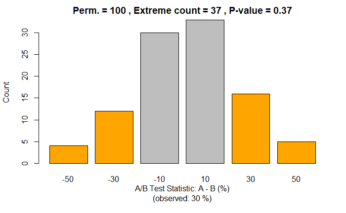
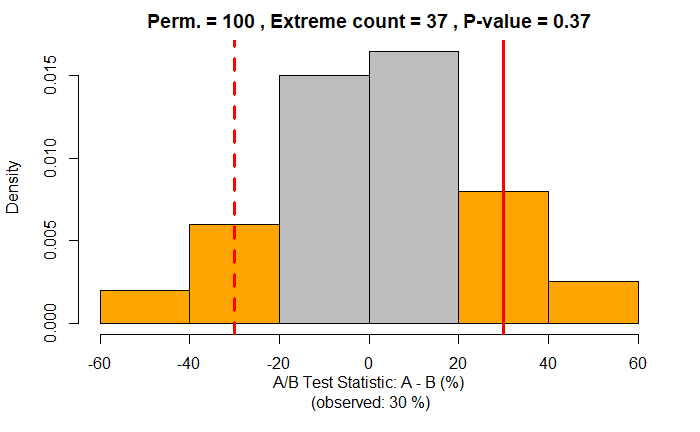
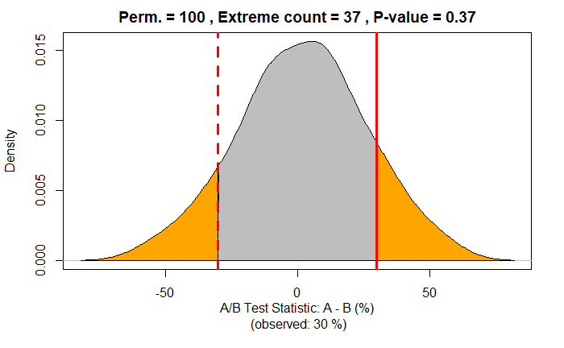

## Outline {.build}

**A/B Testing**

- What? & Why?
- Examples
- How? (Steps)

**Permutation Test**

- What? & Why?
- How? (Steps)
- Hypothesis Testing

**Code**

***R Shiny App***

# A/B Test -- What? & Why?

## A/B Test -- What? & Why? {.build}

**What?** An experiment to compare two competing ***options*** (A, B).

- ***Options:*** treatments (medical), designs (ad, web), products, prices, etc.

**Why?** To determine if the options are ***different***.

- ***Different*** in a statistical sense (hypothesis testing, permutation test).

**Why?** To determine what's the ***better*** option.

- ***Better*** for the question/goal at hand (customer acquisition, profit, etc).

# A/B Test -- Examples?

## A/B Test -- Examples? -- General {.build}

**Two soil treatments:** which one promotes ***better seed germination***?

**Two web headlines:** which one produces ***more clicks***?

**Two web ads:** which one generates ***more conversions***?

**Two prices:**

- which one yields a ***higher net profit***?
- which one leads to ***more new costumers***?

**Two therapies:** which one is ***more effective at suppressing cancer***?

- **Control group:** subjects exposed to ***no treatment*** or ***standard treatment***.
- **Treatment group:** subjects exposed to the ***new treatment***.

## A/B Test -- Examples? -- Specific {.build}

**Microsoft (Bing):**

- one A/B test
- changing the way the Bing search engine displayed ad headlines
- led to a 12% increase in revenue
- that's more than $100 million per year in the US alone

**Amazon:**

- moving credit card offers from its home page to the shopping cart page
- boosted profits by tens of millions of dollars annually

**Google & Bing:** only 10% to 20% of experiments generate positive results

<div style="font-size:80%">
Reference: [The Surprising Power of Online Experiments (Harvard Business Review, 2017)](https://hbr.org/2017/09/the-surprising-power-of-online-experiments)
</div>

# A/B Test -- How?

## A/B Test -- How? -- Didactic Example {.build}

A/B test results (e.g., in a web context):

<div style="line-height:50%; margin:auto; margin-bottom:3%; width:50%;">
  |              | Option A | Option B |
  | :----------- | -------: | -------: |
  | Total        |       10 |       10 |
  | No           |        3 |        6 |
  | Yes          |        7 |        4 |
  | Yes Rate (%) |     70 % |     40 % |
</div>

**Test statistic:** Yes Rate Difference (A - B) (%) = 70% - 40% = 30 %

**Question:** Is this difference (statistically) significant?

(Note: this example uses small/unrealistic numbers for didactic purposes.)

## A/B Test -- How? -- Steps {.build}

( **0. Idea & Definition:** question, goal, data/subjects, options, test statistic. )

**1. Subjects:** Set of all subjects.

**2. Randomization:** Randomly assign subjects to the two groups (A, B).

**3. Results:** Expose subjects to the different options (A, B), measure results, and compute **test statistic**.

**4. Hypothesis testing:** determine if the observed results are statistically significant. This can be done with a **permutation test**.

( **5. Action/Decision:** based on test results. )

## A/B Test -- How? -- Steps 1 to 3 (diagram)

<iframe src="figures/ab-steps-fig.html"></iframe>

## A/B Test -- How? -- Steps 1 to 3 (diagram, subjects)

<iframe src="figures/ab-subjects-fig.html"></iframe>

## A/B Test -- How? -- Hypothesis Testing (Step 4) {.build .smaller}

(**Step 3:** We observed a 30% difference between A and B. **Step 4:** Is it significant?)

Thanks to **randomization** (step 2), any observed difference between A and B must be due to either:

- Random chance (e.g., in assignment of subjects), or
- A true difference between A and B

**Hypothesis testing:** Is random chance a reasonable explanation for the observed effect?

<div style="line-height:10%; margin:auto; margin-bottom:1%; width:80%;">
  |                            | **Two-way** hypothesis test        | **One-way** hypothesis test              |
  | :------------------------- | :--------------------------------- | :--------------------------------------- |
  | **Null hypothesis**        | $A = B$ (A and B are the same)     | $A \leq B$ (A is worst or the same as B) |
  | **Alternative hypothesis** | $A \neq B$ (A and B are different) | $A > B$ (A is better than B)             |
</div>

**Hypothesis test:**

- Assumes that the Null hypothesis is true
- Creates the corresponding "null model" (a probability model)
- Tests whether the observed effect is a reasonable outcome of that model
  - Is the observed effect within the random variability of the "null model"?

## A/B Test -- How? -- Hypothesis Testing (p-value) {.build .smaller}

**P-value:** given a chance model that embodies the null hypothesis, the p-value is the probability of obtaining results as unusual/extreme as the observed result.

**Significance Level (alpha):** the probability threshold of "unusualness" (typically 0.05 or 5%). Must be defined before the experiment.

- Probability of type I error (false positive).

**Decision:**

- `p-value > alpha`: retain the null hypothesis -- observed effect due to chance
- `p-value < alpha`: reject the null hypothesis -- observed effect is real/significant

**Type I error (false positive)**: Mistakenly concluding that an effect is real (when it is due to chance).

**Type II error (false negative)**: Mistakenly concluding that an effect is due to chance (when it is real)

# Permutation Test

## Permutation Test -- What? & Why? {.build .smaller}

**What? & Why?** Permutation test is a resampling procedure used for hypothesis testing.

**Resampling:** repeatedly sample values from the observed data to assess a statistic's random variability.

Two main types of resampling procedures:

- ***Boostrap:*** resampling **with** replacement, used to assess reliability of an estimate.
- ***Permutation:*** resampling **without** replacement, used for hypothesis testing.

**Permutation Test:** 

* A resampling procedure used for hypothesis testing
* Process for combining two (or more) data samples together, and randomly (or exhaustively) reallocating the observations to resamples
* A way to create the "null model", and compute the p-value

## Permutation Test -- How? -- Steps {.build .smaller}

**Step 0:** A/B test results

**Step 1:** Combine all A/B test results (A & B) in a single dataset (a "bag").

**Steps 2 to 5: Do one permutation:**

- **Step 2:** Shuffle the "bag".
- **Step 3:** Randomly draw (without replacement) a resample of the size of group A.
- **Step 4:** Randomly draw (without replacement) a resample of the same size as group B (the remainder).
- **Step 5:** Record the test statistic for the A and B resamples.

**Step 6: Done many permutations:**

- Repeat the previous steps (2 to 5) a sufficient large number of times to yield a permutation distribution of the test statistic. Each time is a different permutation.

**Hypothesis testing:** Use permutation results to compute the p-value as the ratio of values that are as or more extreme than the observed test statistic (in the A/B test result).

## Permutation Test -- Steps (diagram)

<iframe src="figures/permutation-steps-fig.html"></iframe>

## Permutation Test -- Steps (diagram, subjects)

<iframe src="figures/permutation-subjects-fig.html"></iframe>

## Permutation Test -- Hypothesis Testing {.build}

Summary (counts) table of results from 100 permutations:

<div style="line-height:50%; margin:auto; margin-bottom:5%; width:50%;">
  |                    |     |     |     |     |     |     |
  | :----------------- | --: | --: | --: | --: | --: | --: |
  | Permutation Result | -50 | -30 | -10 |  10 |  30 |  50 |
  | Counts             |   4 |  12 |  30 |  33 |  16 |   5 |
</div>

**Two-way hypothesis test** (Null: $A = B$, Alternative: $A \neq B$)

- Number of extreme values: 37 (= 4 + 12 + 16 + 5)
- Ratio of extreme values (p-value): **0.37** (= 37 / 100)

**One-way hypothesis test** (Null: $A \leq B$, Alternative: $A > B$)

- Number of positive extreme values: 21 (= 16 + 5)
- Ratio of positive extreme values (p-value): **0.21** (= 21 / 100)

## Permutation Test -- Bar Plots

<div style="line-height:50%; margin:auto; margin-bottom:5%; width:50%;">
  |                    |     |     |     |     |     |     |
  | :----------------- | --: | --: | --: | --: | --: | --: |
  | Permutation Result | -50 | -30 | -10 |  10 |  30 |  50 |
  | Counts             |   4 |  12 |  30 |  33 |  16 |   5 |
</div>

 

## Permutation Test -- Histogram Plots

<div style="line-height:50%; margin:auto; margin-bottom:5%; width:50%;">
  |                    |     |     |     |     |     |     |
  | :----------------- | --: | --: | --: | --: | --: | --: |
  | Permutation Result | -50 | -30 | -10 |  10 |  30 |  50 |
  | Counts             |   4 |  12 |  30 |  33 |  16 |   5 |
</div>

 

## Permutation Test -- Density Plot (Probability)

<div style="line-height:50%; margin:auto; margin-bottom:5%; width:50%;">
  |                    |     |     |     |     |     |     |
  | :----------------- | --: | --: | --: | --: | --: | --: |
  | Permutation Result | -50 | -30 | -10 |  10 |  30 |  50 |
  | Counts             |   4 |  12 |  30 |  33 |  16 |   5 |
</div>



# Code

## Code -- A/B Test -- Didactic Example {.smaller}

```{r}
# Define minimum set of variables that fully define the A/B test results
t = 20     # Total number of subjects (A + B)
a = 10     # Number of subjects in group A
b = 10     # Number of subjects in group B
a_yes = 7  # Number of successes (yes) in group A
b_yes = 4  # Number of successes (yes) in group B

# Compute remaining A/B test results (using the variables above)
a_no = a - a_yes                # Number of failures (no) in group A
b_no = b - b_yes                # Number of failures (no) in group B
t_yes = a_yes + b_yes           # Total (A + B) successes (yes)
t_no  = a_no  + b_no            # Total (A + B) failures (no)
a_yes_pc = 100 * a_yes / a      # Percentage of successes (yes) in group A
b_yes_pc = 100 * b_yes / b      # Percentage of successes (yes) in group B
ab_yes_pc = a_yes_pc - b_yes_pc # A/B Test Statistic: Percentage of successes (yes) difference (A - B)

cat('Observed Yes Rate (%):  A:', a_yes_pc, ',  B:', b_yes_pc, ',  A-B:', ab_yes_pc)
```

## Code -- Permutation Test -- One Permutation {.smaller}

```{r}
set.seed(0) # for reproducible results
bag1 = c(rep(1, t_yes), rep(0, t_no)) # Step 1: Combine all results in a bag
bag2 = sample(bag1)                   # Step 2: Shuffle the bag
a_rs = bag2[1:a]                      # Step 3: Random sample of size A
b_rs = bag2[(a+1):(a+b)]              # Step 4: Random sample of size B

# Step 5: Compute the test statistic (difference in proportion of 1s)
a_yes_pc_rs = 100 * sum(a_rs) / a
b_yes_pc_rs = 100 * sum(b_rs) / b
ab_yes_pc_rs = a_yes_pc_rs - b_yes_pc_rs

cat('(1) Bag         :', bag1, 
    '\n(2) Bag shuffled:', bag2, 
    '\n(3) A resample  :', a_rs, 
    '\n(4) B resample  :', rep(' ', a), b_rs, 
    '\n(5) Resample Yes Rate (%):  A:', a_yes_pc_rs, ',  B:', b_yes_pc_rs, ',  A-B:', ab_yes_pc_rs,
    '\n    Observed Yes Rate (%):  A:', a_yes_pc, ',  B:', b_yes_pc, ',  A-B:', ab_yes_pc)
```

## Code -- Permutation Test -- Many Permutations {.smaller}

```{r}
set.seed(1) # for reproducible results

bag = c(rep(1, t_yes), rep(0, t_no)) # Step 1: Combine all results in a bag

# Step 6: Repeat steps 2 to 5 a "large" number of times (p)
p = 100              # number of permutations
perm_res = rep(0, p) # vector for permutation results
for (i in 1:p) {
  bag = sample(bag)                               # Step 2: Shuffle the bag
  a_rs = bag[1:a]                                 # Step 3: Random sample of size A
  b_rs = bag[(a+1):(a+b)]                         # Step 4: Random sample of size B
  perm_res[i] = 100*sum(a_rs)/a - 100*sum(b_rs)/b # Step 5: Compute the test statistic
}

perm_res
```

## Code -- Permutation Test -- Hypothesis Testing {.smaller}

```{r}
table(perm_res)
```
```{r}
# Two-way hypothesis test (Null: A = B, Alternative: A != B)
extreme_count = sum(abs(perm_res) >= abs(ab_yes_pc))
extreme_ratio = extreme_count / p
# One-way hypothesis test (Null: A =< B, Alternative: A > B)
pos_extreme_count = sum(perm_res >= ab_yes_pc)
pos_extreme_ratio = pos_extreme_count / p
cat("Number of permutations                            :", p,
    "\nNumber of extreme values                          :", extreme_count,
    "\nRatio of extreme values (two-way p-value)         :", extreme_ratio,
    "\nNumber of positive extreme values                 :", pos_extreme_count,
    "\nRatio of positive extreme values (one-way p-value):", pos_extreme_ratio)
```

## Code -- Permutation Test -- Bar Plot (Counts)

```{r, echo=FALSE}
table(perm_res)
```
```{r, echo=FALSE}
counts = table(perm_res)
colors = ifelse(abs(as.numeric(names(counts))) < abs(ab_yes_pc), 'gray', 'orange')
title = paste("Perm. =", p, ", Extreme count =", extreme_count, ", P-value =", extreme_ratio)
x_lab = paste("A/B Test Statistic: A - B (%)\n(observed:", ab_yes_pc, "%)")
barplot(counts, col=colors, main=title, xlab=x_lab, ylab="Count")
```

## Code -- Permutation Test -- Bar Plot (Probability)

```{r, echo=FALSE}
table(perm_res)
```
```{r, echo=FALSE}
barplot(counts / p, col=colors, main=title, xlab=x_lab, ylab="Density")
```

## Code -- Permutation Test -- Histogram (Counts)

```{r, echo=FALSE}
table(perm_res)
```
```{r, echo=FALSE}
h = hist(perm_res, breaks = "Scott", plot=FALSE)
b_left = abs(h$breaks[-length(h$breaks)])
b_right = abs(h$breaks[-1])
b_max = ifelse(b_left > b_right, b_left, b_right)
colors = ifelse(b_max < abs(ab_yes_pc), 'gray', 'orange')
title = paste("Perm. =", p, 
              ", Extreme count =", extreme_count,
              ", P-value =", extreme_ratio)
x_lab = paste("A/B Test Statistic: A - B (%)\n",
              "(observed:", ab_yes_pc, "%)")
plot(h, col=colors, main=title, xlab=x_lab, ylab="Count")
abline(v = ab_yes_pc, col = 'red', lwd = 3)
abline(v = -ab_yes_pc, col = 'red', lty = 2, lwd = 3)
```

## Code -- Permutation Test -- Histogram (Prob.)

```{r, echo=FALSE}
table(perm_res)
```
```{r, echo=FALSE}
plot(h, col=colors, freq=FALSE, main=title, xlab=x_lab)
abline(v = ab_yes_pc, col = 'red', lwd = 3)
abline(v = -ab_yes_pc, col = 'red', lty = 2, lwd = 3)
```

## Code -- Permutation Test -- Density Plot (Prob.)

```{r, echo=FALSE}
table(perm_res)
```

```{r, echo=FALSE}
title = paste("Perm. =", p, 
              ", Extreme count =", extreme_count,
              ", P-value =", extreme_ratio)
x_lab = paste("A/B Test Statistic: A - B (%)\n",
              "(observed:", ab_yes_pc, "%)")
d = density(perm_res, adjust=2)
plot(d, main=title, xlab=x_lab)
xc = abs(ab_yes_pc)
c1 = (d$x < -xc) # extreme negative values (left)
c2 = (abs(d$x) < xc) # non-extreme values
c3 = (d$x > xc) # extreme positive values (right)
polygon(c(d$x[c1], -xc), c(d$y[c1], 0), col='orange')
polygon(c(-xc, d$x[c2], xc), c(0, d$y[c2], 0), col='gray')
polygon(c(xc, d$x[c3]), c(0, d$y[c3]), col='orange')
abline(v = ab_yes_pc, col = 'red', lwd = 3)
abline(v = -ab_yes_pc, col = 'red', lty = 2, lwd = 3)
```

## Code -- General Solution

The previous code has been consolidated into functions in the `functions.R` script.

- The function `ab_permutation_test` can be used to perform the whole process of a Permutation Test for a given A/B Test (examples in the next slides).

```{r}
source("functions.R")
```

## Code -- General Solution -- Didactic Example {.smaller}

```{r}
ab_permutation_test(a_all=10, b_all=10, a_yes=7, b_yes=4, n_p=100, verbose=TRUE, random_seed=1)
```

## Code -- General Solution -- Other Example {.smaller}

```{r}
ab_permutation_test(a_all=1000, b_all=2000, a_yes=30, b_yes=100, n_p=1000, verbose=TRUE, random_seed=1)
```

# R Shiny App

## R Shiny App

You can explore A/B Testing with Permutation Test (i.e., the results of the `ab_permutation_test` function) by using the R Shiny App defined in the `app.R` file, available in the [presentation GitHub repository](https://github.com/nycdatasci/live-learning-sessions/tree/master/ab-testing-with-permutation-test).

Once you have the presentation files in your computer, you can launch the app as usual in RStudio (open the `app.R` file in RStudio and press the `Run App` button).

Alternatively, you can use the following code to run the app in your RStudio (this code downloads the app code from GitHub).

```{r, eval=FALSE}
library(shiny)

runGitHub(repo="live-learning-sessions", username="nycdatasci", 
          subdir="ab-testing-with-permutation-test")
```

# Questions?


