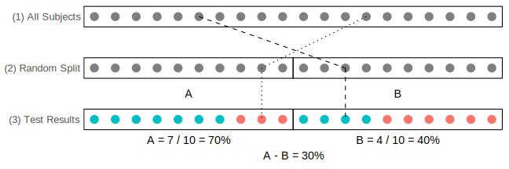

# Intro - A/B Test



**A/B Test:** an experiment to compare two competing **options** (A, B) to determine if one is **better** than the other.

**Options:** treatments (medical), designs (ad, web), products, prices, etc.

**Better?** Answer with **hypothesis testing**, using a **permutation test**.

**Example:** Microsoft / Bing example with 12% lift, $100 million revenue increase ([HBR](https://hbr.org/2017/09/the-surprising-power-of-online-experiments))

# Intro - A/B Test - Nomenclature


**Treatment:** something (e.g., drug) to which a subject is exposed

**Control group:** group of subjects exposed to no treatment (or standard treatment)

**Treatment group:** group of subjects exposed to the treatment

# Intro - A/B Test - Steps


1. Set of all subjects.
2. **Randomization:** Randomly assign the subjects to the two groups (A, B).
3. Expose the subjects to the different options (A, B), and measure the results. Define a **test statistic** to compare the groups.
4. **Hypothesis testing:** determine is the observed results are statistically significant or not. This can be done with a **permutation test**.

# Intro - A/B Test - Key Points


**Test statistic:** metric used to measure the effect of the treatment. Example above: A-B = 30% (A = 70%, B = 40%).

**Randomization:** process of randomly assigning subjects to the two groups. Because of it, any difference between the two groups must be due to one of two things:

1. Random chance in assignment of subjects
2. A real difference between A and B

# Intro - Permutation Test


**Resampling:** repeatedly sample values from the observed data to assess a statistic's random variability.

**Permutation Test:** 

* A resampling procedure used for hypothesis testing
* Process for combining two (or more) data samples together, and randomly (or exhaustively) reallocating the observations to resamples

# Intro - Permutation Test - Steps


1. Combine all A/B test results (A & B) in a single dataset (a "bag").
2. Shuffle the "bag".
3. Randomly draw (without replacement) a resample of the size of group A.
4. Randomly draw (without replacement) a resample of the same size as group B (the remainder).
5. Record the test statistic for the resamples.
6. Repeat the previous steps (2 to 5) sufficient large number of time (`N`) to yield a permutation distribution of the test statistic. Each time is a different permutation.

# Intro - A/B Test with Permutation Test


<hr>


# Example - A/B Test - Results


Results from an A/B test experiment (e.g., in an e-commerce/web context):

|                     | Option A | Option B |
| :------------------ | -------: | -------: |
| Total               |       10 |       10 |
| No Conversion       |        3 |        6 |
| Conversion          |        7 |        4 |
| Conversion Rate (%) |     70 % |     40 % |

**Test statistic:** Conversion Rate Difference (A - B) (%) = 30 %

**Question:** Is this difference (statistically) significant?

(Note: this example uses small numbers for didactic purposes.)

# Example - A/B Test - Code

Define minimum set of variables sufficient to derive all A/B test results:

```{r}
# Total counts by group
a_all = 10
b_all = 10

# Conversion (success) counts by group
a_yes = 7
b_yes = 4
```

Define the remaining A/B test results:

```{r}
# No Conversion (failure) counts by group
a_no = a_all - a_yes
b_no = b_all - b_yes

# Total conversions (yes) and no conversions (no)
n_yes = a_yes + b_yes
n_no  = a_no  + b_no

# Conversion rates (%) by group
a_yes_pct = 100 * a_yes / a_all
b_yes_pct = 100 * b_yes / b_all

# Statistic: Conversion rate difference (A-B) (%)
ab_yes_pct_diff = a_yes_pct - b_yes_pct

cat('Conversion Rate (%)',
    '\n    A:', a_yes_pct, 
    '\n    B:', b_yes_pct,
    '\n  A-B:', ab_yes_pct_diff)
```

# Example - Permutation Test - Steps 1 to 5 (`One` Permutation)

```{r}
set.seed(0) # for reproducible results

# Step 1: Combine all results in a bag
bag1 = c(rep(1, n_yes), rep(0, n_no))

# Step 2: Shuffle the bag
bag2 = sample(bag1)

# Step 3: Draw a random sample of size A
a_rs = bag2[1:a_all]

# Step 4: Draw a random sample of size B (the remainder)
b_rs = bag2[(a_all+1):length(bag2)]

# Step 5: Record the statistic (difference in proportion of 1s)
a_yes_pct_rs = 100 * sum(a_rs) / length(a_rs)
b_yes_pct_rs = 100 * sum(b_rs) / length(b_rs)
ab_yes_pct_diff_rs = a_yes_pct_rs - b_yes_pct_rs

cat('(1) Bag         :', bag1,
    '\n(2) Bag shuffled:', bag2,
    '\n(3) A resample  :', a_rs,
    '\n(4) B resample  :', rep(' ', a_all), b_rs,
    '\n(5) Resample Conversion Rate (%)',
    '\n        A:', a_yes_pct_rs, 
    '\n        B:', b_yes_pct_rs,
    '\n      A-B:', ab_yes_pct_diff_rs)
```
```{r}
cat('Observed Conversion Rate (%):',
    '\n    A:', a_yes_pct,
    '\n    B:', b_yes_pct,
    '\n  A-B:', ab_yes_pct_diff)
```

# Example - Permutation Test - Step 6 (`N` Permutations)

```{r}
set.seed(1) # for reproducible results

# Step 1: Combine all results in a bag
bag = c(rep(1, n_yes), rep(0, n_no))

# Step 6: Repeat steps 2 to 5 a "large" number of times (n_p)
n_p = 100 # number of permutations
perm_res = rep(0, n_p) # vector for permutation results
for (i in 1:n_p) {
  # Step 2: Shuffle the bag
  bag = sample(bag)
  
  # Step 3: Draw a random sample of size A
  all_ind = seq(1, length(bag))
  a_ind = sample(all_ind, a_all)
  a_rs = bag[a_ind]
  
  # Step 4: Draw a random sample of size B (the remainder)
  b_ind = setdiff(all_ind, a_ind)
  b_rs = bag[b_ind]
  
  # Step 5: Record the statistic (difference in proportion of 1s)
  a_yes_pct_rs = 100 * sum(a_rs) / length(a_rs)
  b_yes_pct_rs = 100 * sum(b_rs) / length(b_rs)
  perm_res[i] = a_yes_pct_rs - b_yes_pct_rs
  cat('Permutation', i, ': A-B (%) =', perm_res[i], '\n')
}
```
```{r}
cat('Observed A/B Test statistic: A-B (%) =', ab_yes_pct_diff)
```

# Example - Permutation Test - Hypothesis testing

**Question:** How extreme is the (observed) A/B test statistic compared with the permutation results?

**Solution:** How many permutation results are as or more extreme than the (observed) A/B test statistic?

```{r}
table(perm_res)
```
```{r}
extreme_count = sum(abs(perm_res) >= abs(ab_yes_pct_diff))
extreme_ratio = extreme_count / n_p
cat("Number of permutations           :", n_p,
    "\nNumber of extreme values         :", extreme_count,
    "\nRatio of extreme values (p-value):", extreme_ratio)
```

# Example - Permutation Test - Hypothesis testing - Bar plot

```{r}
counts = table(perm_res)
x = abs(as.numeric(names(counts)))
colors = ifelse(x < abs(ab_yes_pct_diff), 'gray', 'orange')
title = paste("Perm. =", n_p, 
              ", Extreme count =", extreme_count,
              ", P-value =", extreme_ratio)
x_lab = paste("A/B Test Statistic: A - B (%)\n",
              "(observed:", ab_yes_pct_diff, "%)")
y_lab = "Count"
barplot(counts, col=colors, main=title, xlab=x_lab, ylab=y_lab)
y_lab = "Density"
barplot(counts / n_p, col=colors, main=title, xlab=x_lab, 
        ylab=y_lab)
```

# Example - Permutation Test - Hypothesis testing - Histogram plot

```{r}
h = hist(perm_res, breaks = "Scott", plot=FALSE)
b_left = abs(h$breaks[-length(h$breaks)])
b_right = abs(h$breaks[-1])
b_max = ifelse(b_left > b_right, b_left, b_right)
colors = ifelse(b_max < abs(ab_yes_pct_diff), 'gray', 'orange')
title = paste("Perm. =", n_p, 
              ", Extreme count =", extreme_count,
              ", P-value =", extreme_ratio)
x_lab = paste("A/B Test Statistic: A - B (%)\n",
              "(observed:", ab_yes_pct_diff, "%)")
y_lab = "Count"
plot(h, col=colors, main=title, xlab=x_lab, ylab=y_lab)
abline(v = ab_yes_pct_diff, col = 'red', lwd = 3)
abline(v = -ab_yes_pct_diff, col = 'red', lty = 2, lwd = 3)
plot(h, col=colors, freq=FALSE, main=title, xlab=x_lab)
abline(v = ab_yes_pct_diff, col = 'red', lwd = 3)
abline(v = -ab_yes_pct_diff, col = 'red', lty = 2, lwd = 3)
```

# Example - Permutation Test - Hypothesis testing - Density plot

```{r}
title = paste("Perm. =", n_p, 
              ", Extreme count =", extreme_count,
              ", P-value =", extreme_ratio)
x_lab = paste("A/B Test Statistic: A - B (%)\n",
              "(observed:", ab_yes_pct_diff, "%)")
d = density(perm_res, adjust=2)
plot(d, main=title, xlab=x_lab)
xc = abs(ab_yes_pct_diff)
c1 = (d$x < -xc) # extreme negative values (left)
c2 = (abs(d$x) < xc) # non-extreme values
c3 = (d$x > xc) # extreme positive values (right)
polygon(c(d$x[c1], -xc), c(d$y[c1], 0), col='orange')
polygon(c(-xc, d$x[c2], xc), c(0, d$y[c2], 0), col='gray')
polygon(c(xc, d$x[c3]), c(0, d$y[c3]), col='orange')
abline(v = ab_yes_pct_diff, col = 'red', lwd = 3)
abline(v = -ab_yes_pct_diff, col = 'red', lty = 2, lwd = 3)
```

# General Solution - Same Example

```{r}
source("help.R")
```

```{r}
a_all = 10
b_all = 10
a_yes = 7
b_yes = 4
n_p = 100
set.seed(1)
ab_permutation_test(a_all, b_all, a_yes, b_yes, n_p, verbose=TRUE)
```

# General Solution - Other Example

```{r}
a_all = 1000
b_all = 2000
a_yes = 30
b_yes = 100
n_p = 1000
set.seed(1)
ab_permutation_test(a_all, b_all, a_yes, b_yes, n_p, verbose=TRUE)
```

# R Shiny App
