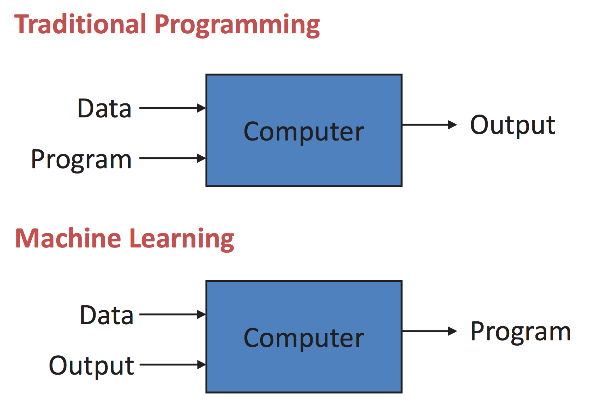
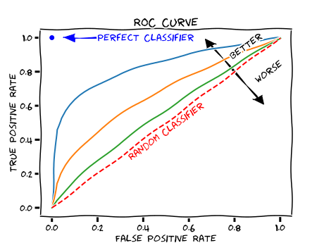
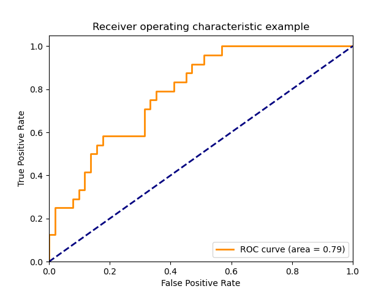
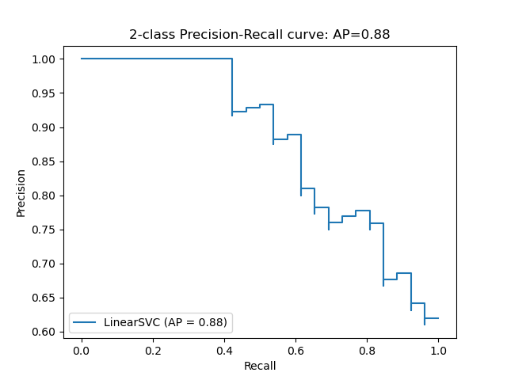

# Outline, Objectives, Prerequisities

.pull-left[

### Outline / Objectives

Introduction: Machine Learning, Classification

(Binary) Classification

- 4 Outcome Types & 2 Error Types
- Confusion Matrix (*Activity, Code*)
- Evaluation Metrics
  - Confusion Matrix (*Activity, Code*)
      - Accuracy, Precision, Recall, Specificity
  - ROC curve & ROC AUC
  - Precision-Recall Curve

Summary & Extra Notes

- Imbalanced Classification
- Multiclass Classification

]

--

.pull-right[

### Prerequisities

**Required:** Pen (or pencil) and paper.

**Good to have (*but not required*):**

- Some knowledge of Machine Learning and Classification.

- Understand R and/or Python.

]

---

# Introduction

.pull-left[

.center[

*Machine Learning vs Traditional Programming*



]

**Machine Learning (ML):** learning from data

- *Unsupervised ML:* learning from *unlabeled* data
- **Supervised ML:** learning from **labeled** data
  - *Regression:* predict a *numeric* variable
  - **Classification:** predict a **categorical** variable

<p style="font-size:70%; font-style: italic;">Image credits: Pedro Domingos (left), Edureka (right)</p>

]

--

.pull-right[

.center[

*Machine Learning Process*


]

**Model Evaluation:** How to evaluate a Classification model?
- By comparing **predicted** vs **actual** outputs

**Classification:**
- **Binary** or *Multiple* classes
- **Balanced** or *Imbalanced* classes

]

---

# 4 Outcome Types & 2 Error Types

| $y_{actual}$ | $y_{predicted}$ | *Outcome Type* | *Meaning* | *Example* |
| :----------: | :-------------: | -------------- | --------- | --------- |
| 1 | 1 | $\color{green}{\text{True Positive}}$   | <span style="font-size:80%">Model **correctly** predicts the **positive** (1) class.</span> | <span style="font-size:80%">Model predicts **cancer (1)** *and* it's actually **cancer (1)**.</span>         |
| 0 | 0 | $\color{blue}{\text{True Negative}}$    | <span style="font-size:80%">Model **correctly** predicts the **negative** (0) class.</span> | <span style="font-size:80%">Model predicts **not cancer (0)** *and* it's actually **not cancer (0)**.</span> |
| 0 | 1 | $\color{orange}{\text{False Positive}}$ | <span style="font-size:80%">Model **wrongly** predicts the **positive** (1) class.</span>   | <span style="font-size:80%">Model predicts **cancer (1)** *but* it's actually **not cancer (0)**.</span>     |
| 1 | 0 | $\color{red}{\text{False Negative}}$    | <span style="font-size:80%">Model **wrongly** predicts the **negative** (0) class.</span>   | <span style="font-size:80%">Model predicts **not cancer (0)** *but* it's actually **cancer (1)**.</span>     |

.pull-left[

**Actual / Predicted:**

* $y_{actual}$: the actual/observed/real class.
* $y_{predicted}$: the class predicted by the model.

***Outcome Type:***

* **True / False:** model prediction is *correct (True)* or *wrong (False)*, as compared to the actual class.
* **Positive / Negative:** the two classes in binary classification: *Positive (1)* or *Negative (0)* class.

]

.pull-right[

**The 2 Error Types**

* *Type I error:* $\color{orange}{\text{False Positive}}$
* *Type II error:* $\color{red}{\text{False Negative}}$

***What's the worst error type?***

* It depends on the nature of the problem at hand.
* In the cancer example a $\color{red}{\text{False Negative}}$ is potentially worse than a $\color{orange}{\text{False Positive}}$.

]

---

# Confusion Matrix

.left-40[

.center[**Model Results on Test Dataset (S = 10)**]
  
| $y_{actual}$ | $y_{predicted}$ | *Outcome Type*                               |
| ------------ | --------------- | -------------------------------------------- |
|            1 |               1 | $\color{green}{\text{True Positive (TP)}}$   |
|            0 |               0 | $\color{blue}{\text{True Negative (TN)}}$    |
|            0 |               1 | $\color{orange}{\text{False Positive (FP)}}$ |
|            1 |               0 | $\color{red}{\text{False Negative (FN)}}$    |
|            0 |               0 | $\color{blue}{\text{TN}}$   |
|            1 |               1 | $\color{green}{\text{TP}}$  |
|            0 |               0 | $\color{blue}{\text{TN}}$   |
|            0 |               1 | $\color{orange}{\text{FP}}$ |
|            0 |               0 | $\color{blue}{\text{TN}}$   |
|            1 |               1 | $\color{green}{\text{TP}}$  |

]

.right-60[

.center[**Confusion Matrix**]

| *Counts*                                  | Predicted Positive <br> $y_{predicted} = 1$  | Predicted Negative <br> $y_{predicted} = 0$ |
| :---------------------------------------: | :------------------------------------------: | :-----------------------------------------: |
| **Actual Positive** <br> $y_{actual} = 1$ | $\color{green}{\text{#TP = 3}}$  | $\color{red}{\text{#FN = 1}}$   |
| **Actual Negative** <br> $y_{actual} = 0$ | $\color{orange}{\text{#FP = 2}}$ | $\color{blue}{\text{#TN = 4}}$   |

- Shows counts of correct and wrong results by outcome type
- Fundamental tool to evaluate classification model quality
- Most classification metrics are derived from Confusion Matrix
- Can be computed for the training and testing datasets
  - Train/Test results can be compared to check for overfitting
  - Ultimately, the test dataset results are the decisive ones
- *Reversed* version: **Actual** in columns and **Predicted** in rows
- *Ratios* version: Counts / Total (e.g., $\color{green}{\text{#TP/S = 3/10 = 0.3}}$)

]

---

# Confusion Matrix - Activity (5 min)

.left-40[

.center[**Model Results on Test Dataset (S = 10)**]
  
| $y_{actual}$ | $y_{pred}$ | *Type*                                       |
| ------------ | ---------- | -------------------------------------------- |
|            1 |          1 | $\color{green}{\text{True Positive (TP)}}$   |
|            1 |          0 | $\color{red}{\text{False Negative (FN)}}$    |
|            0 |          0 | $\color{blue}{\text{True Negative (TN)}}$    |
|            0 |          1 | $\color{orange}{\text{False Positive (FP)}}$ |
|            0 |          0 | |
|            1 |          1 | |
|            0 |          0 | |
|            0 |          1 | |
|            0 |          0 | |
|            1 |          1 | <p></p> |

]

.right-60[

.center[**Confusion Matrix**]
  
.pull-left[

| *Counts*         | $y_{pred} = 1$               | $y_{pred} = 0$               |
| ---------------- | :--------------------------: | :--------------------------: |
| $y_{actual} = 1$ | $\color{green}{\text{#TP}}$  | $\color{red}{\text{#FN}}$    |
| $y_{actual} = 0$ | $\color{orange}{\text{#FP}}$ | $\color{blue}{\text{#TN}}$   |

]
  
.pull-right[

| *Ratios*         | $y_{pred} = 1$                 | $y_{pred} = 0$                 |
| ---------------- | :----------------------------: | :----------------------------: |
| $y_{actual} = 1$ | $\color{green}{\text{#TP/S}}$  | $\color{red}{\text{#FN/S}}$    |
| $y_{actual} = 0$ | $\color{orange}{\text{#FP/S}}$ | $\color{blue}{\text{#TN/S}}$   |

]
  
<br>
  
**Q1:** Which dataset(s) should we be looking at here (train, test, both)?
  
**Q2:** Of the 4 types (TP, FN, TN, FP), how many and which ones are errors? Are the different types of errors equally bad? Or can some be worse?
  
**Q3:** Why/When use these two Confusion Matrix versions (Counts, Ratio)? 

]

---

# Confusion Matrix - Activity - Solutions

.left-40[

.center[**Model Results on Test Dataset (S = 10)**]
  
| $y_{actual}$ | $y_{pred}$ | *Type*                                       |
| ------------ | ---------- | -------------------------------------------- |
|            1 |          1 | $\color{green}{\text{True Positive (TP)}}$   |
|            1 |          0 | $\color{red}{\text{False Negative (FN)}}$    |
|            0 |          0 | $\color{blue}{\text{True Negative (TN)}}$    |
|            0 |          1 | $\color{orange}{\text{False Positive (FP)}}$ |
|            0 |          0 | $\color{blue}{\text{TN}}$   |
|            1 |          1 | $\color{green}{\text{TP}}$  |
|            0 |          0 | $\color{blue}{\text{TN}}$   |
|            0 |          1 | $\color{orange}{\text{FP}}$ |
|            0 |          0 | $\color{blue}{\text{TN}}$   |
|            1 |          1 | $\color{green}{\text{TP}}$  |

]

.right-60[

.center[**Confusion Matrix**]
  
.pull-left[

| *Counts*         | $y_{pred} = 1$      | $y_{pred} = 0$      |
| ---------------- | :-----------------: | :-----------------: |
| $y_{actual} = 1$ | $\color{green}{3}$  | $\color{red}{1}$    |
| $y_{actual} = 0$ | $\color{orange}{2}$ | $\color{blue}{4}$   |

]
  
.pull-right[

| *Ratios*         | $y_{pred} = 1$        | $y_{pred} = 0$        |
| ---------------- | :-------------------: | :-------------------: |
| $y_{actual} = 1$ | $\color{green}{0.3}$  | $\color{red}{0.1}$    |
| $y_{actual} = 0$ | $\color{orange}{0.2}$ | $\color{blue}{0.4}$   |

]
  
<br>
  
**Q1:** Which dataset(s) should we be looking at here (train, test, both)?
  
**Q2:** Of the 4 types (TP, FN, TN, FP), how many and which ones are errors? Are the different types of errors equally bad? Or can some be worse?
  
**Q3:** Why/When use these two Confusion Matrix versions (Counts, Ratio)? 

]


---

# Confusion Matrix - Code - R

.small[

.pull-left[

```{r}
y_actual = factor(c(1, 0, 0, 1, 0, 1, 0, 0, 0, 1))
y_pred   = factor(c(1, 0, 1, 0, 0, 1, 0, 1, 0, 1))
table(y_actual, y_pred)
```

```{r}
table(y_pred, y_actual)
```

```{r, message=FALSE, warning=FALSE}
library(caret)
cm = confusionMatrix(data=y_pred, reference=y_actual)
cm$table
```

```{r, echo=FALSE, message=FALSE, warning=FALSE}
#library(yardstick)
#library(ggplot2)
#autoplot(conf_mat(table(y_pred, y_actual)), type='heatmap')
```

]

.pull-right[

```{r, dpi=300, message=FALSE, out.width="80%", warning=FALSE}
library(cvms)
cm_df = data.frame(cm$table)
names(cm_df) = c('Prediction', 'Target', 'N')
plot_confusion_matrix(cm_df)
```

]

]

---

# Confusion Matrix - Code - Python

<iframe src="python-notebooks/confusion-matrix.html" height="530" width=700"></iframe>

---

# Metrics - Confusion Matrix

| Total = P + N                             | Predicted Positive <br> $y_{pred} = 1$       | Predicted Negative <br> $y_{pred} = 0$    |          |
| :---------------------------------------: | :------------------------------------------: | :---------------------------------------: | -------- |
| **Actual Positive** <br> $y_{actual} = 1$ | $\color{green}{\text{True Positive (TP)}}$   | $\color{red}{\text{False Negative (FN)}}$ | Recall = TPR = $\frac{ \color{green}{\text{TP}} }{ \color{green}{\text{TP}} + \color{red}{\text{FN}} }$ |
| **Actual Negative** <br> $y_{actual} = 0$ | $\color{orange}{\text{False Positive (FP)}}$ | $\color{blue}{\text{True Negative (TN)}}$ | Specificity = TNR = $\frac{ \color{blue}{\text{TN}} }{ \color{orange}{\text{FP}} + \color{blue}{\text{TN}} }$ |
|                                           | Precision = $\frac{ \color{green}{\text{TP}} }{ \color{green}{\text{TP}} + \color{orange}{\text{FP}} }$ | | Accuracy = $\frac{ \color{green}{\text{TP}} + \color{blue}{\text{TN}} }{ \color{green}{\text{TP}} + \color{blue}{\text{TN}} + \color{orange}{\text{FP}} + \color{red}{\text{FN}} }$ |

<br>

| Metric        | Definition / Meaning    |
| ------------- | ----------------------- |
| **Accuracy**  | proportion of all cases classified correctly |
| **Precision** | proportion of predicted positives that are actual positives |
| **Recall** (*Sensitivity*, *TPR*) | proportion of actual positives classified correctly |
| **Specificity** (*Selectivity*, *TNR*) | proportion of actual negatives classified correctly |

Others: ROC AUC, Precision-Recall AUC, F1 score

---

# Metrics - Confusion Matrix - Activity (5 min)

| Total = P + N                             | Predicted Positive <br> $y_{pred} = 1$       | Predicted Negative <br> $y_{pred} = 0$    |          |
| :---------------------------------------: | :------------------------------------------: | :---------------------------------------: | -------- |
| **Actual Positive** <br> $y_{actual} = 1$ | $\color{green}{\text{TP} = 3}$   | $\color{red}{\text{FN} = 1}$ | Recall = TPR = $\frac{ \color{green}{\text{TP}} }{ \color{green}{\text{TP}} + \color{red}{\text{FN}} }$ = **???** |
| **Actual Negative** <br> $y_{actual} = 0$ | $\color{orange}{\text{FP} = 2}$ | $\color{blue}{\text{TN} = 4}$ | Specificity = TNR = $\frac{ \color{blue}{\text{TN}} }{ \color{orange}{\text{FP}} + \color{blue}{\text{TN}} }$ = **???** |
|                                           | Precision = $\frac{ \color{green}{\text{TP}} }{ \color{green}{\text{TP}} + \color{orange}{\text{FP}} }$ = **???** | | Accuracy = $\frac{ \color{green}{\text{TP}} + \color{blue}{\text{TN}} }{ \color{green}{\text{TP}} + \color{blue}{\text{TN}} + \color{orange}{\text{FP}} + \color{red}{\text{FN}} }$ = **???** |

---

# Metrics - Confusion Matrix - Activity - Solution

| Total = P + N                             | Predicted Positive <br> $y_{pred} = 1$       | Predicted Negative <br> $y_{pred} = 0$    |          |
| :---------------------------------------: | :------------------------------------------: | :---------------------------------------: | -------- |
| **Actual Positive** <br> $y_{actual} = 1$ | $\color{green}{\text{TP} = 3}$   | $\color{red}{\text{FN} = 1}$ | Recall = TPR = $\frac{ \color{green}{\text{TP}} }{ \color{green}{\text{TP}} + \color{red}{\text{FN}} }$ = **0.75** |
| **Actual Negative** <br> $y_{actual} = 0$ | $\color{orange}{\text{FP} = 2}$ | $\color{blue}{\text{TN} = 4}$ | Specificity = TNR = $\frac{ \color{blue}{\text{TN}} }{ \color{orange}{\text{FP}} + \color{blue}{\text{TN}} }$ = **0.67** |
|                                           | Precision = $\frac{ \color{green}{\text{TP}} }{ \color{green}{\text{TP}} + \color{orange}{\text{FP}} }$ = **0.60** | | Accuracy = $\frac{ \color{green}{\text{TP}} + \color{blue}{\text{TN}} }{ \color{green}{\text{TP}} + \color{blue}{\text{TN}} + \color{orange}{\text{FP}} + \color{red}{\text{FN}} }$ = **0.70** |

---

# Metrics - Confusion Matrix - Code - R

.pull-left[

```{r}
confusionMatrix(data=y_pred, reference=y_actual, 
                positive='1')
```

]

.pull-right[

```{r}
confusionMatrix(data=y_pred, reference=y_actual, 
                positive='1', mode="prec_recall")
```

]

---

# Metrics - Confusion Matrix - Code - Python

<iframe src="python-notebooks/metrics-confusion-matrix.html" height="530" width=700"></iframe>

---

# Metrics - ROC AUC

.pull-left[



**Receiver Operating Characteristic (ROC) curve**

- Sensitivity vs Specificity, by discrimination threshold
- Y axis: **TPR** (*Recall*, *Sensitivity*) = $\frac{ \color{green}{\text{TP}} }{ \text{P} }$ = $\frac{ \color{green}{\text{TP}} }{ \color{green}{\text{TP}} + \color{red}{\text{FN}} }$
- X axis (*2 versions*):
  - **FPR** = 1 - Specificity = $\frac{ \color{orange}{\text{FP}} }{ \text{N} }$ = $\frac{ \color{orange}{\text{FP}} }{ \color{orange}{\text{FP}} + \color{blue}{\text{TN}} }$
  - TNR = Specificity = $\frac{ \color{blue}{\text{TN}} }{ \text{N} }$ = $\frac{ \color{blue}{\text{TN}} }{ \color{orange}{\text{FP}} + \color{blue}{\text{TN}} }$

]

.pull-right[



**Area under the ROC curve (ROC AUC)**

- Higher ROC AUC => Better (more effective) classifier
- ROC AUC = 1 for perfect classifier
- ROC AUC = 0.5 for random (ineffective) classifier
- Robust metric for evaluating/comparing classifier(s)

<span style="font-size:70%; font-style: italic;">*Image sources: [Wikipedia / xkcd](https://en.wikipedia.org/wiki/File:Roc-draft-xkcd-style.svg) (left) [sklearn](https://scikit-learn.org/stable/modules/model_evaluation.html#receiver-operating-characteristic-roc) (right)*</span>

]

---

# Metrics - Precision-Recall

.pull-left[

**Precision** = $\frac{ \color{green}{\text{TP}} }{ \color{green}{\text{TP}} + \color{orange}{\text{FP}} }$

- ratio of predicted positives that are actual positives
- ability of not classifying negative samples as positive

**Recall** (*Sensitivity*, *TPR*) = $\frac{ \color{green}{\text{TP}} }{ \color{green}{\text{TP}} + \color{red}{\text{FN}} }$

- ratio of actual positives classified correctly
- ability of the classifier to find all the positive samples

**F1 score**: Harmonic mean of Precision and Recall:

- $\text{F1 score} = 2 \frac{\text{Precision} \times \text{Recall}}{\text{Precision} + \text{Recall}}$

**Trade-off** between the two error types:

* *Type I error:* $\color{orange}{\text{False Positive (FP)}}$
* *Type II error:* $\color{red}{\text{False Negative (FN)}}$


Image source: [sklearn](https://scikit-learn.org/stable/auto_examples/model_selection/plot_precision_recall.html#precision-recall)

]

.pull-right[



**Precision-Recall curve**

- Precision (Y) vs Recall (X) by discriminant threshold
- **Average Precision (AP):** weighted mean of precisions
- **Precision-Recall AUC:** area under the curve
- Robust metric, useful for imbalanced classes

]

---

# Summary & Extra Notes

.pull-left[

.center[**Summary**]

Introduction

- Supervised Machine Learning, Classification
- Evaluating Classification Models

4 Outcome & 2 Error Types

Confusion Matrix

Simpler Metrics: Accuracy, Precision, Recall, Specificity

Robust/Trade-off Metrics:

- ROC curve & ROC AUC
- Precision-Recall:
  - F1 score
  - Precision-Recall curve: AP & AUC

]

--

.pull-right[

.center[**Extra Notes**]

Imbalanced classification:

* Different frequencies for different classes
* Use Robust/Trade-off metrics in model evaluation
* Python:
  * `sklearn`: use `class_weight = 'balanced'` in some algorithms (e.g., Logistic Regression)
  * `imbalanced-learn`: more advanced (over/under) sampling algorithms

Multiple classes:

* We looked at Binary Classification (2 classes)
* The concepts generalize for multiple classes

]
