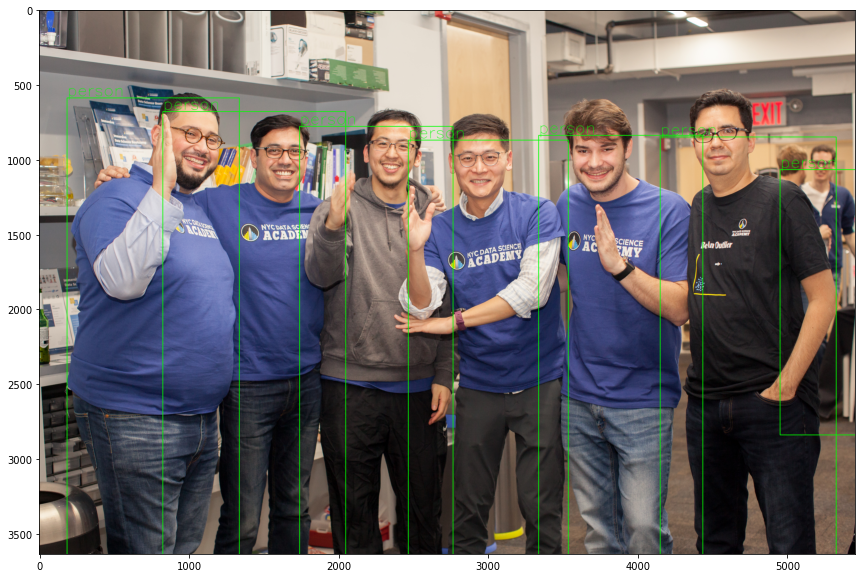

### Introduction to Object Detection

 

- Object detection is an important topic in the computer vision industry and there have been some breakthrough after the convolutional neural network was introduced. We will walk you through the history of object detection and explore the different features of each model from this [notebook](https://colab.research.google.com/drive/1bjk1429lI77wY5zamod9FJdhYdRwtu4z?usp=sharing) on Google Colab.
- We will discuss the YOLOv3 model in the notebook. You only look once (YOLO) is a state-of-the-art, real-time object detection system. YOLOv3 is the latest version from the original author. It is much faster than other object detection algorithms like R-CNN, Faster R-CNN, or SSD due to the unique approach by applying a single neural network to the full image.  

